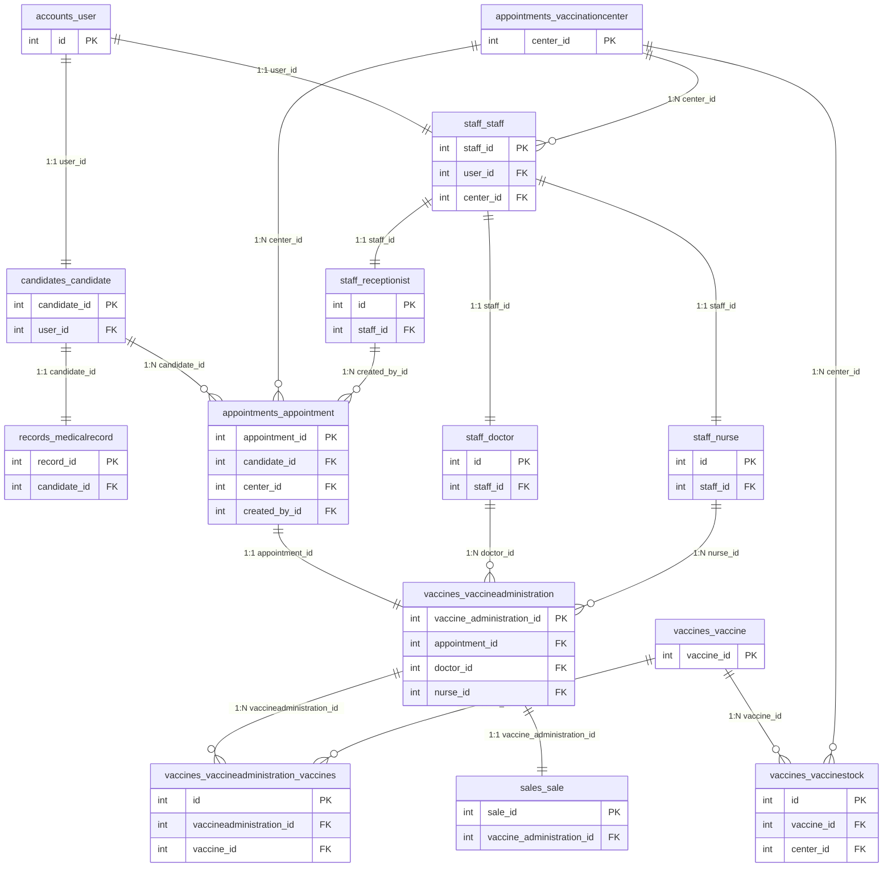

# 🗄️ Sơ đồ Quan hệ Cơ sở Dữ liệu (Chỉ gồm PK, FK)

Dưới đây là sơ đồ quan hệ dạng thực thể liên kết (ER Diagram) thể hiện **chỉ các khóa chính (PK) và khóa ngoại (FK)** của các bảng trong cơ sở dữ liệu sau khi đã được cập nhật chính xác theo yêu cầu nghiệp vụ:

---

## 🔑 Hướng dẫn Import vào Draw.io
Để đưa sơ đồ này vào phần mềm Draw.io:
1. Sao chép đoạn mã nguồn Mermaid ở trên (từ dòng `erDiagram` đến hết).
2. Truy cập [draw.io](https://app.diagrams.net/).
3. Trên thanh công cụ của Draw.io, chọn **Arrange** (Sắp xếp) -> **Insert** (Chèn) -> **Advanced** (Nâng cao) -> **Mermaid...**.
4. Dán đoạn mã Mermaid vào khung nhập liệu và nhấn **Insert** (Chèn). Draw.io sẽ tự động dựng thành sơ đồ hình học hoàn chỉnh cho bạn!
