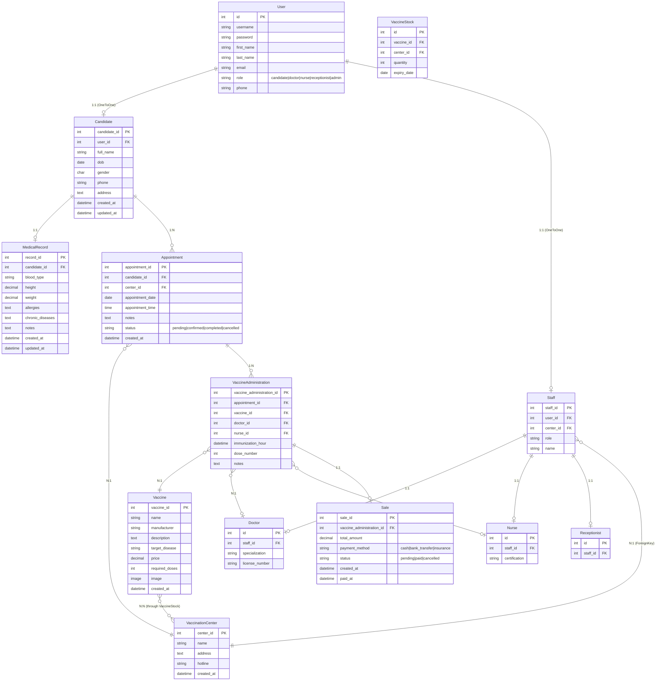
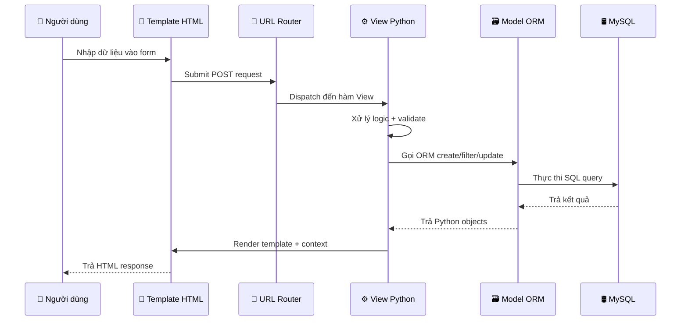
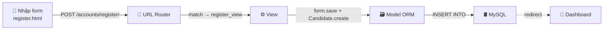

# 🏗️ Phân Tích Kiến Trúc Hệ Thống Treat or Chet

## Tổng quan

Hệ thống **Treat or Chet** sử dụng **Django (Python)** theo mô hình **MTV (Model - Template - View)**, tương đương với MVC truyền thống:

| MTV (Django) | MVC (Truyền thống) | Vai trò |
|---|---|---|
| **Model** | Model | Định nghĩa cấu trúc CSDL, tương tác với MySQL |
| **Template** | View | Giao diện HTML hiển thị cho người dùng (Frontend) |
| **View** | Controller | Xử lý logic, nhận request, trả response (Backend) |

---

## 1. 🗄️ Thiết Kế Cơ Sở Dữ Liệu

### 1.1 Sơ đồ quan hệ (ER Diagram)



### 1.2 Các loại quan hệ trong hệ thống

| Quan hệ | Kiểu | Ví dụ cụ thể | Ý nghĩa |
|---|---|---|---|
| **1:1** (OneToOne) | `OneToOneField` | `User ↔ Candidate` | 1 User chỉ có 1 hồ sơ Candidate |
| **1:1** (OneToOne) | `OneToOneField` | `Candidate ↔ MedicalRecord` | 1 Candidate chỉ có 1 hồ sơ y tế |
| **1:N** (ForeignKey) | `ForeignKey` | `Candidate → Appointment` | 1 Candidate có nhiều Appointment |
| **1:N** (ForeignKey) | `ForeignKey` | `VaccinationCenter → Staff` | 1 Center có nhiều nhân viên |
| **N:N** (ManyToMany) | `ManyToManyField` | `Vaccine ↔ VaccinationCenter` | 1 Vaccine có ở nhiều Center, 1 Center có nhiều Vaccine |
| **ISA** (Kế thừa) | `OneToOneField` | `Staff → Doctor/Nurse/Receptionist` | Chuyên biệt hóa vai trò |

### 1.3 Django Model → MySQL Table

> [!IMPORTANT]
> Django sử dụng **ORM (Object-Relational Mapping)** — bạn viết class Python, Django tự tạo bảng SQL tương ứng khi chạy `makemigrations` + `migrate`.

**Ví dụ 1:** Model `MedicalRecord` → bảng MySQL (đã bao gồm height/weight theo ER)

Xem code: [records/models.py](file:///d:/TrickorChet/vaccinems/apps/records/models.py)

```python
class MedicalRecord(models.Model):
    record_id = models.AutoField(primary_key=True)
    candidate = models.OneToOneField(Candidate, on_delete=models.CASCADE)
    blood_type = models.CharField(max_length=5, blank=True, choices=[...])
    height = models.DecimalField(max_digits=5, decimal_places=2, null=True, blank=True)
    weight = models.DecimalField(max_digits=5, decimal_places=2, null=True, blank=True)
    allergies = models.TextField(blank=True)
    chronic_diseases = models.TextField(blank=True)
    notes = models.TextField(blank=True)
```

Django tự động tạo SQL:

```sql
CREATE TABLE records_medicalrecord (
    record_id      INT AUTO_INCREMENT PRIMARY KEY,
    candidate_id   INT UNIQUE NOT NULL,    -- FK 1:1 → candidates_candidate
    blood_type     VARCHAR(5),
    height         DECIMAL(5,2) NULL,
    weight         DECIMAL(5,2) NULL,
    allergies      TEXT,
    chronic_diseases TEXT,
    notes          TEXT,
    created_at     DATETIME NOT NULL,
    updated_at     DATETIME NOT NULL,
    FOREIGN KEY (candidate_id) REFERENCES candidates_candidate(candidate_id) ON DELETE CASCADE
);
```

**Ví dụ 2:** Model `VaccineStock` → bảng trung gian N:N (đã bao gồm expiry_date theo ER)

Xem code: [vaccines/models.py](file:///d:/TrickorChet/vaccinems/apps/vaccines/models.py)

```python
class VaccineStock(models.Model):
    vaccine = models.ForeignKey(Vaccine, on_delete=models.CASCADE)
    center = models.ForeignKey(VaccinationCenter, on_delete=models.CASCADE)
    quantity = models.IntegerField(default=0)
    expiry_date = models.DateField(null=True, blank=True)

    class Meta:
        unique_together = ['vaccine', 'center']   # Mỗi cặp (vaccine, center) là duy nhất
```

Django tự động tạo SQL:

```sql
CREATE TABLE vaccines_vaccinestock (
    id           INT AUTO_INCREMENT PRIMARY KEY,
    vaccine_id   INT NOT NULL,
    center_id    INT NOT NULL,
    quantity     INT DEFAULT 0,
    expiry_date  DATE NULL,
    FOREIGN KEY (vaccine_id) REFERENCES vaccines_vaccine(vaccine_id) ON DELETE CASCADE,
    FOREIGN KEY (center_id) REFERENCES appointments_vaccinationcenter(center_id) ON DELETE CASCADE,
    UNIQUE KEY (vaccine_id, center_id)
);
```

> [!NOTE]
> `unique_together = ['vaccine', 'center']` đảm bảo không có 2 dòng cùng vaccine + center. Đây là cách Django triển khai **bảng trung gian** cho quan hệ N:N với thuộc tính riêng (`quantity`, `expiry_date`).

---

## 2. 🔗 Luồng Liên Kết Frontend ↔ Backend ↔ Database

### 2.1 Tổng quan luồng dữ liệu



### 2.2 Chuỗi liên kết file cụ thể

```
📄 templates/                    ← Frontend (HTML + Django Template Language)
    ↓ POST request
🔀 config/urls.py               ← URL Router cấp 1 (phân theo app)
    ↓
🔀 apps/*/urls.py               ← URL Router cấp 2 (match chính xác)
    ↓
⚙️ apps/*/views.py              ← Backend logic (xử lý request)
    ↓ gọi ORM
🗃️ apps/*/models.py             ← Model → SQL
    ↓
🛢️ MySQL (vaccinems_db)         ← Cơ sở dữ liệu
```

### 2.3 Cấu trúc URL 2 cấp

File: [config/urls.py](file:///d:/TrickorChet/vaccinems/config/urls.py)

```python
urlpatterns = [
    path('admin/',        admin.site.urls),
    path('accounts/',     include('apps.accounts.urls',     namespace='accounts')),
    path('dashboard/',    include('apps.candidates.urls',   namespace='candidates')),
    path('appointments/', include('apps.appointments.urls', namespace='appointments')),
    path('vaccines/',     include('apps.vaccines.urls',     namespace='vaccines')),
    path('records/',      include('apps.records.urls',      namespace='records')),
    path('sales/',        include('apps.sales.urls',        namespace='sales')),
    path('',              RedirectView.as_view(url='/dashboard/')),
]
```

Ví dụ luồng URL:
```
/appointments/book/
    → config/urls.py: match 'appointments/' → chuyển tiếp
    → appointments/urls.py: match 'book/' → gọi views.book_appointment
```

---

## 3. 📝 Ví Dụ 1: Đăng Ký Tài Khoản

### Bước 1: Frontend — Form HTML

File: [register.html](file:///d:/TrickorChet/vaccinems/templates/accounts/register.html#L24-L59)

```html
<form method="post" class="form-vc">
    
    <div class="row g-3">
        <div class="col-6">
            <label class="form-label">Họ</label>
            <input type="text" name="last_name" class="form-control" required>
        </div>
        <div class="col-6">
            <label class="form-label">Tên</label>
            <input type="text" name="first_name" class="form-control" required>
        </div>
        <div class="col-12">
            <label class="form-label">Tên đăng nhập</label>
            <input type="text" name="username" class="form-control" required>
        </div>
        <!-- ... password fields ... -->
        <button type="submit">Đăng ký</button>
    </div>
</form>
```

> [!TIP]
> - `method="post"` → gửi dữ liệu qua HTTP POST (bảo mật hơn GET)
> - `name="last_name"` → đây là key trong `request.POST` phía backend
> - `` → token bảo vệ chống tấn công CSRF

### Bước 2: URL Routing

File: [accounts/urls.py](file:///d:/TrickorChet/vaccinems/apps/accounts/urls.py)

```python
app_name = 'accounts'
urlpatterns = [
    path('login/',    views.login_view,    name='login'),
    path('register/', views.register_view, name='register'),  # ← match!
    path('logout/',   views.logout_view,   name='logout'),
]
```

### Bước 3: Backend View

File: [accounts/views.py](file:///d:/TrickorChet/vaccinems/apps/accounts/views.py#L39-L54)

```python
def register_view(request):
    form = RegisterCandidateForm(request.POST or None)

    if request.method == 'POST' and form.is_valid():
        # ① Tạo User trong database
        user = form.save(commit=False)       # Chưa lưu vào DB
        user.role = User.ROLE_CANDIDATE      # Gán role = 'candidate'
        user.save()                          # → INSERT INTO accounts_user ...

        # ② Tạo Candidate profile liên kết với User
        Candidate.objects.create(            # → INSERT INTO candidates_candidate ...
            user=user,
            full_name=user.get_full_name(),
            phone=user.phone,
        )

        # ③ Tự động đăng nhập + redirect
        login(request, user)
        messages.success(request, 'Đăng ký thành công!')
        return redirect('candidates:dashboard')

    # GET request: render form trống
    return render(request, 'accounts/register.html', {'form': form})
```

### Bước 4: ORM → SQL thực thi trên MySQL

```sql
-- Bước ①: Tạo user
INSERT INTO accounts_user (username, password, first_name, last_name, email, phone, role)
VALUES ('nguyen_vana', 'hashed_pw', 'Văn A', 'Nguyễn', 'vana@email.com', '0901234567', 'candidate');

-- Bước ②: Tạo candidate profile
INSERT INTO candidates_candidate (user_id, full_name, phone)
VALUES (42, 'Nguyễn Văn A', '0901234567');
```

### Luồng hoàn chỉnh



---

## 4. 📝 Ví Dụ 2: Đặt Lịch Hẹn

### Bước 1: Frontend — Form đặt lịch

File: [book.html](file:///d:/TrickorChet/vaccinems/templates/appointments/book.html#L17-L48)

```html
<form method="post" class="form-vc">
    

    <!-- Dropdown — dữ liệu từ backend (View truyền biến 'centers') -->
    <select name="center" class="form-select" required>
        <option value="">-- Chọn trung tâm --</option>
        
        <option value="{{ center.pk }}">{{ center.name }} — {{ center.address }}</option>
        
    </select>

    <input type="date" name="appointment_date" class="form-control" required>
    <input type="time" name="appointment_time" class="form-control" required>
    <textarea name="notes" class="form-control"></textarea>
    <button type="submit">Xác nhận đặt lịch</button>
</form>
```

> [!NOTE]
> `` — **Django Template Language** lặp qua danh sách `centers` do View truyền vào.
> `{{ center.pk }}` — primary key, gửi về backend khi submit.

### Bước 2: Backend View

File: [appointments/views.py](file:///d:/TrickorChet/vaccinems/apps/appointments/views.py#L9-L38)

```python
@login_required                                    # ← Bắt buộc đăng nhập
def book_appointment(request):
    # Kiểm tra quyền
    if not request.user.is_candidate_user():
        return redirect('candidates:dashboard')

    # Đọc DB: lấy candidate + danh sách centers
    candidate = get_object_or_404(Candidate, user=request.user)
    # → SELECT * FROM candidates_candidate WHERE user_id = ?

    centers = VaccinationCenter.objects.all().order_by('name')
    # → SELECT * FROM appointments_vaccinationcenter ORDER BY name

    if request.method == 'POST':
        # Đọc dữ liệu từ form HTML
        center_id = request.POST.get('center')            # <select name="center">
        appointment_date = request.POST.get('appointment_date')
        appointment_time = request.POST.get('appointment_time')

        # Validate + Tạo mới trong DB
        center = get_object_or_404(VaccinationCenter, pk=center_id)
        Appointment.objects.create(
            candidate=candidate,
            center=center,
            appointment_date=appointment_date,
            appointment_time=appointment_time,
            notes=request.POST.get('notes', ''),
        )
        # → INSERT INTO appointments_appointment (...) VALUES (...)

        messages.success(request, 'Đặt lịch hẹn thành công!')
        return redirect('appointments:my_list')

    # GET: render form + truyền centers vào template
    return render(request, 'appointments/book.html', {'centers': centers})
```

### Bước 3: ORM → SQL

```sql
-- GET request: Lấy danh sách trung tâm cho dropdown
SELECT * FROM appointments_vaccinationcenter ORDER BY name;

-- POST request: Tạo lịch hẹn mới
INSERT INTO appointments_appointment
    (candidate_id, center_id, appointment_date, appointment_time, notes, status, created_at)
VALUES
    (5, 2, '2026-05-15', '09:00:00', 'Không dị ứng', 'pending', NOW());
```

---

## 5. 🔑 Tổng Kết

### Cách Frontend gửi dữ liệu đến Backend

| Cơ chế | Code Frontend | Code Backend |
|---|---|---|
| **Form POST** | `<form method="post">` | `request.POST.get('field_name')` |
| **URL parameter** | `<a href="/appointments/5/">` | `def detail(request, pk):` |
| **Query string** | `<a href="?status=pending">` | `request.GET.get('status')` |

### Cách Backend tương tác với Database (ORM)

| Thao tác | Code Python (ORM) | SQL tương đương |
|---|---|---|
| **Tạo** | `Model.objects.create(...)` | `INSERT INTO ...` |
| **Đọc tất cả** | `Model.objects.all()` | `SELECT * FROM ...` |
| **Lọc** | `Model.objects.filter(status='pending')` | `SELECT * WHERE status='pending'` |
| **Lấy 1 bản ghi** | `get_object_or_404(Model, pk=5)` | `SELECT * WHERE id=5` |
| **Cập nhật** | `obj.status = 'confirmed'; obj.save()` | `UPDATE ... SET status='confirmed'` |
| **Xóa** | `obj.delete()` | `DELETE FROM ... WHERE id=?` |
| **Tổng hợp** | `Model.objects.aggregate(Sum('qty'))` | `SELECT SUM(qty) FROM ...` |
| **Annotate** | `Model.objects.annotate(total=Sum(...))` | `SELECT *, SUM(...) AS total FROM ...` |

### Cách Backend truyền dữ liệu đến Frontend

```python
# View truyền context dictionary vào template
return render(request, 'template.html', {
    'centers': centers,          # QuerySet → dùng  trong template
    'appointment': appointment,  # Object → dùng {{ appointment.status }}
    'total_stock': total_stock,  # Số → dùng {{ total_stock }}
})
```

```html
<!-- Template sử dụng Django Template Language -->

    <option value="{{ center.pk }}">{{ center.name }}</option>


<p>Trạng thái: {{ appointment.get_status_display }}</p>
<p>Tồn kho: {{ total_stock }} liều</p>
```

### Kết nối Django ↔ MySQL

File: [settings.py](file:///d:/TrickorChet/vaccinems/config/settings.py#L57-L70)

```python
DATABASES = {
    'default': {
        'ENGINE': 'django.db.backends.mysql',   # MySQL connector
        'NAME': 'vaccinems_db',                  # Tên database
        'USER': 'root',
        'PASSWORD': '****',
        'HOST': 'localhost',
        'PORT': '3306',
    }
}
```

> [!TIP]
> Mọi lệnh ORM (`objects.create()`, `objects.filter()`, `aggregate()`, ...) đều đi qua kết nối MySQL này. Django tự chuyển đổi Python → SQL và ngược lại.
